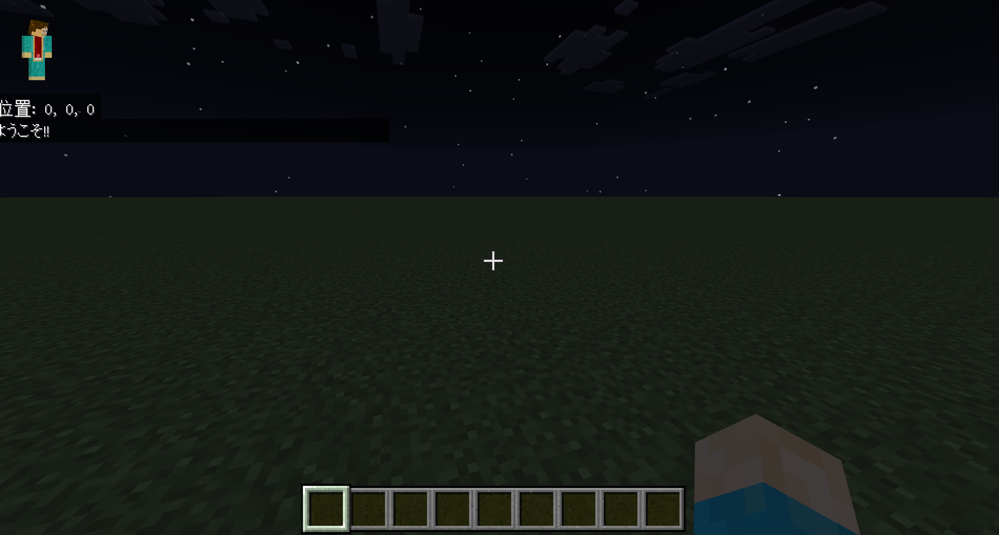

# BDS + ビヘイビア + リソースパックの開発テンプレート



## 環境構築
1. Docker インストール
2. .env作成
```bash
cp .env.example .env
```
3. 起動
```bash
docker compose up -d
```
4. BDSログ確認
```bash
docker compose logs bds -f
```
5. サーバー終了
```bash
docker compose down
```

## 開発手順
1. src/BP/scripts 配下にて TypeScript でコーディング
2. サーバー起動時に TypeScript から JavaScript にトランスパイルされる
3. ログを確認してデバッグなど


## その他
- トランスパイル時に BP, RPのmanifest.jsonからUUIDを抜き出して worlds/DevWorld/world_*_packs.json に入れているので意識しなくていいです
- template/* はベータAPIを有効化したワールドをテンプレートとしておいてます。必要であればコピーして worlds/DevWorld 内に入れて下さい

## 推奨事項
- VSCodeで開発する場合 .vscode/extensions.json に記載の拡張機能を入れるとよいです


## 今後
- npm でほかプラグインやライブラリを入れてバンドル後のソースでBPとするなど
